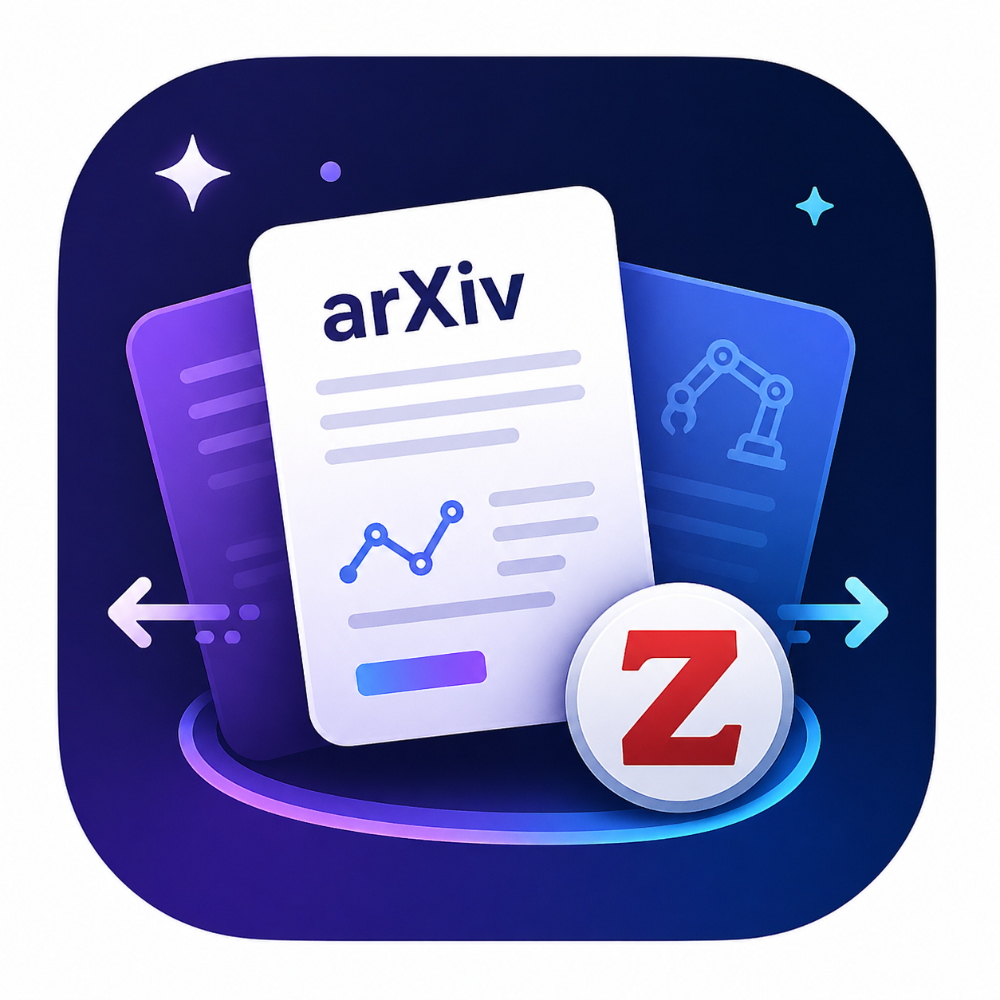

# 📚 XivDaily

<div align="center">
  

  <p>
    <strong>面向科研阅读场景的每日 arXiv 论文工作台</strong>
  </p>

  <p>
    原生 Android 客户端 + FastAPI 后端，聚焦论文快筛、AI 导读、收藏管理与 Zotero 同步。
  </p>
</div>

## ✨ 项目简介

`XivDaily` 是一个给科研人员和 AI 开发者使用的移动端论文快筛工具。

当前版本已经把“每天看论文”的核心闭环跑通：

- 🔎 从 arXiv 拉取论文流，支持领域筛选、时间窗口和关键词搜索
- 🧠 首页展示 AI 趋势简报，帮助快速判断近期研究热点
- 🌐 支持单篇摘要中文翻译，适合快速扫读英文论文
- ⭐ 收藏感兴趣的论文，并在本地收藏库持续管理
- 📚 将论文同步到 Zotero，或批量导出 BibTeX
- ⚙️ 在设置页管理默认偏好、Zotero 配置和大模型 API 配置
- 🧪 后端、Android 编译和模拟器主流程均已有验收记录

这个项目适合以下场景：

- 每天想快速浏览指定方向的最新 arXiv 论文
- 想用移动端完成论文初筛、收藏和稍后阅读整理
- 想把论文发现流程和 Zotero 文献库串起来
- 想在摘要层面先看中文导读，再决定是否深入阅读全文

## 🚀 核心特性

- **每日论文流**：首页按领域和时间窗口加载论文，关键词搜索覆盖全 arXiv，并保留清晰的空状态与错误提示。
- **AI 趋势简报**：趋势摘要固定查看最近 3 天动态，和论文列表时间窗解耦，避免筛选条件影响宏观趋势判断。
- **摘要翻译**：单篇论文可触发摘要翻译，翻译中、失败和成功状态都有独立 UI 反馈。
- **本地收藏库**：收藏数据通过 Room 持久化，支持同步状态筛选、单条删除、批量选择和批量删除。
- **Zotero 工作流**：首页和收藏库都能触发 Zotero 同步，收藏库支持选中论文导出 BibTeX。
- **偏好与配置管理**：默认领域、默认时间窗口、主题、显示名和头像偏好通过 DataStore 保存。
- **双端联调结构**：Android Debug 包默认连接模拟器宿主机后端，FastAPI 提供论文、AI、配置和 Zotero API。

## 🖼️ 应用界面

当前模拟器验收截图位于 `docs/qa/xiv-013-device-screenshots/`：

- 🏠 `home.png`：首页论文流、搜索区、领域/时间筛选、AI 趋势简报和底部导航
- ⭐ `library.png`：收藏库、同步状态筛选、星标、同步 Zotero 和删除操作
- ⚙️ `settings.png`：设置页、本地头像、默认偏好、Zotero 配置和大模型配置入口
- 📚 `zotero-dialog.png`：Zotero User ID、个人库/群组库、API Key、目标集合配置
- 🤖 `llm-dialog.png`：大模型 Base URL、Model、API Key 配置

## 🏗️ 架构概览

```text
Android App (Kotlin + Compose)
    │
    ├── Home：论文流 / AI 趋势 / 摘要翻译 / 收藏 / Zotero 同步
    ├── Library：本地收藏 / 同步状态筛选 / BibTeX 导出
    └── Settings：偏好设置 / Zotero 配置 / LLM 配置
    │
    ├── Room：收藏论文本地持久化
    ├── DataStore：用户偏好持久化
    └── Retrofit：访问后端 API
        │
        ▼
FastAPI Backend
    │
    ├── /papers：arXiv 论文检索与缓存降级
    ├── /summaries/trends：AI 趋势摘要
    ├── /translations：摘要翻译
    ├── /config/*：集成配置读写与测试
    └── /zotero/*：同步状态、单篇同步、BibTeX 导出
```

## 🛠️ 技术栈

| 模块 | 技术选型 |
| --- | --- |
| Android 客户端 | Kotlin、Jetpack Compose、Material 3 |
| Android 架构 | MVVM、Navigation Compose、Repository |
| 本地存储 | Room、DataStore |
| 网络访问 | Retrofit、Moshi、OkHttp Logging Interceptor |
| 后端服务 | Python、FastAPI、SQLAlchemy |
| 数据迁移 | Alembic |
| 测试 | Pytest、Gradle/JUnit |

## 📦 目录结构

```text
android/
├── app/src/main/java/com/xivdaily/app/
│   ├── data/          # Retrofit、Room、DataStore、Repository
│   ├── ui/            # Compose 页面、导航、主题、ViewModel
│   └── di/            # 应用依赖容器
└── logo.png           # README 与应用使用的 Logo

backend/
├── app/
│   ├── api/           # health、papers、ai、config、zotero 路由
│   ├── clients/       # arXiv / Zotero 客户端
│   ├── services/      # 论文、AI、配置、Zotero 业务逻辑
│   └── models/        # SQLAlchemy 模型
├── migrations/        # Alembic 迁移
└── tests/             # 后端自动化测试

docs/
├── api-contract.md
├── local-development.md
├── deployment/
└── qa/
```

## ⚡ 快速开始

### 1. 启动后端

```powershell
conda run -n xivdaily pip install -r backend/requirements.txt
cd backend
conda run -n xivdaily alembic upgrade head
conda run -n xivdaily uvicorn app.main:app --host 127.0.0.1 --port 8000
```

常用接口示例：

```text
GET http://127.0.0.1:8000/health
GET http://127.0.0.1:8000/papers?category=cs.CV&days=3&page=1&pageSize=20
GET http://127.0.0.1:8000/summaries/trends?category=cs.CV&days=3
GET http://127.0.0.1:8000/config/integrations
GET http://127.0.0.1:8000/zotero/config/status
```

### 2. 构建 Android Debug 包

```powershell
cd android
.\gradlew.bat :app:assembleDebug --no-daemon --console=plain
```

Debug 构建默认访问：

```text
http://10.0.2.2:8000/
```

这个地址用于 Android 模拟器访问宿主机本地后端。

### 3. 安装到模拟器

```powershell
D:\AndroidSdk\platform-tools\adb.exe install -r android/app/build/outputs/apk/debug/app-debug.apk
D:\AndroidSdk\platform-tools\adb.exe shell am start -n com.xivdaily.app/.MainActivity
```

## 🧪 验证记录

最近一次验收记录见 `docs/qa/xiv-013-final-acceptance-2026-04-30.md`。

已记录通过的关键检查：

- ✅ 后端全量测试：`36 passed in 2.02s`
- ✅ Android Kotlin 编译：`:app:compileDebugKotlin` 构建成功
- ✅ Android Debug APK：`:app:assembleDebug` 构建成功
- ✅ 模拟器安装启动：`adb install` 和 `am start` 成功
- ✅ 主界面截图：首页、收藏库、设置页、Zotero 弹窗、LLM 弹窗均有截图证据
- ✅ 稳定性检查：最近 `logcat` 未出现 `FATAL EXCEPTION`

## 🔐 配置说明

敏感信息不提交到仓库，运行时通过环境变量、忽略文件或应用设置页写入。

后端 `.env.example` 提供本地配置模板。Android 端的 Zotero 和大模型配置可以直接在设置页维护，配置读取和保存由后端 `/config/*` 接口承接。

## 📚 参考文档

- `docs/architecture-overview.md`：整体架构说明
- `docs/api-contract.md`：后端接口契约
- `docs/android-model-mapping.md`：Android 数据模型映射
- `docs/local-development.md`：本地开发说明
- `docs/deployment/local-run.md`：本地运行流程
- `docs/qa/xiv-013-final-acceptance-2026-04-30.md`：最终验收记录

## 🙏 致谢

本项目通过 arXiv public API 获取论文元数据。感谢 arXiv 提供开放获取互操作性，
使研究工具能够在遵守其 API 使用规范的前提下连接论文发现、筛选和阅读流程。

## 📄 License

本项目采用 Apache License 2.0 开源协议，详见 [LICENSE](./LICENSE)。

Apache-2.0 允许使用、修改和分发项目代码，并包含明确的专利授权与免责声明。
