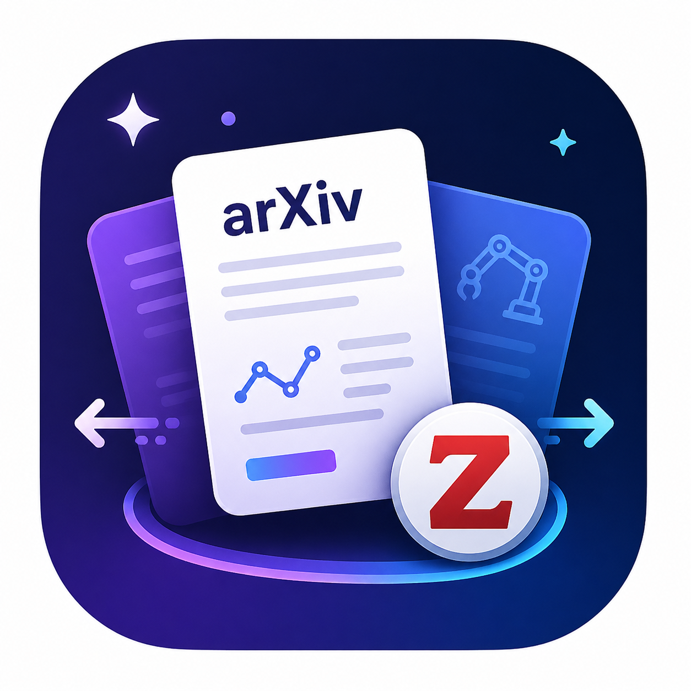
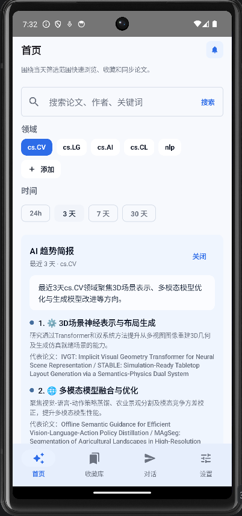
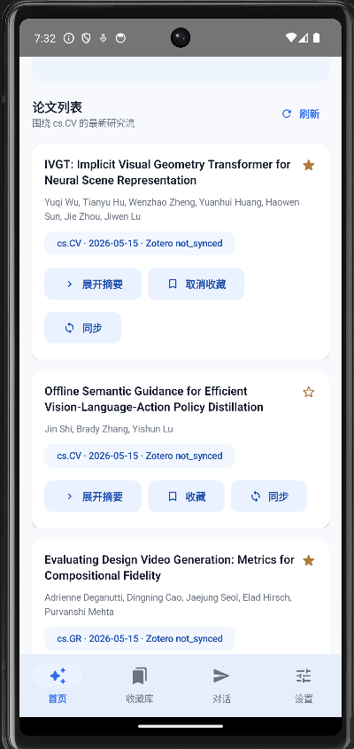
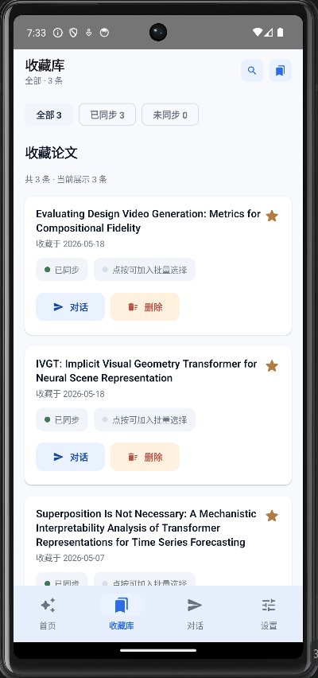
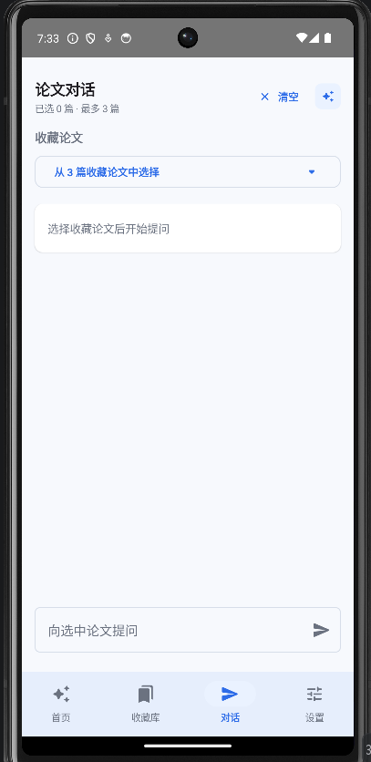
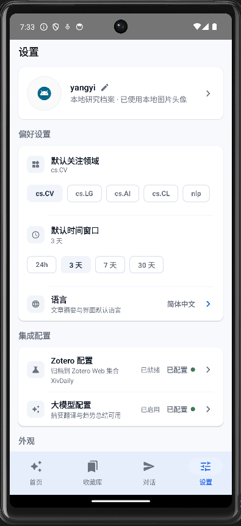
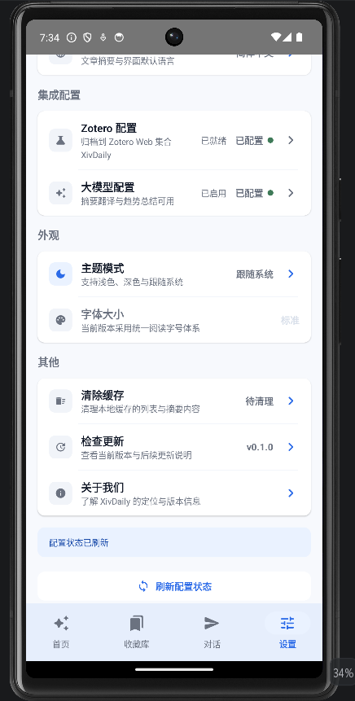

# 📚 XivDaily

<div align="center">
  

  <p>
    <strong>面向科研阅读场景的 arXiv 移动工作台</strong>
  </p>

  <p>
    Android · HarmonyOS · FastAPI · AI 导读 · Zotero 同步
  </p>
</div>

## ✨ 项目概览

`XivDaily` 试图把「发现论文 → 快速筛选 → 收藏归档 → 深入对话」这条科研阅读链路压缩到移动端里完成。

| 组件 | 目录 | 主要职责 | 当前状态 |
| --- | --- | --- | --- |
| 🤖 Android 客户端 | `android/` | Jetpack Compose 论文流、收藏库、论文对话、设置页 | 已落地四页主流程与本地收藏 |
| 🌈 HarmonyOS 客户端 | `harmony/` | ArkUI 版本的首页、收藏、对话、设置体验 | 已落地 Stage 模型单模块应用 |
| ⚙️ FastAPI 后端 | `backend/` | arXiv 检索、本地论文库、趋势摘要、摘要翻译、论文对话、Zotero 同步 | 已具备本地可运行接口与后台同步能力 |
| 🖼️ 演示资源 | `asset/` | Android / Harmony 双端界面截图 | 可直接用于 README 展示与汇报材料 |

## 🚀 核心能力

| 能力 | 说明 |
| --- | --- |
| 📄 论文流 | 后端按 `cs.CV`、`cs.AI`、`cs.CL` 等分类同步本地论文库，客户端支持关键词、时间窗口与分页 |
| 🧠 AI 导读 | 提供趋势摘要、摘要翻译与多论文对话，未配置模型时走明确降级提示 |
| ⭐ 收藏管理 | Android 与 Harmony 客户端都提供本地收藏、筛选与跳转对话入口 |
| 🔄 Zotero 同步 | 后端支持目标集合检查、单篇同步与 BibTeX 导出 |
| ⚙️ 运行时配置 | LLM / Zotero 配置可以通过设置页与后端接口联动维护 |

## 🖼️ Demo 展示

### 🤖 Android

<table>
  <tr>
    <td align="center">
      <br />
      <sub>首页 · 论文流</sub>
    </td>
    <td align="center">
      <br />
      <sub>首页 · 趋势与操作区</sub>
    </td>
    <td align="center">
      <br />
      <sub>收藏库 · 筛选与同步状态</sub>
    </td>
  </tr>
  <tr>
    <td align="center">
      <br />
      <sub>论文对话 · 多论文问答</sub>
    </td>
    <td align="center">
      <br />
      <sub>设置 · 偏好与账号</sub>
    </td>
    <td align="center">
      <br />
      <sub>设置 · Zotero 与 LLM</sub>
    </td>
  </tr>
</table>

### 🌈 HarmonyOS

<table>
  <tr>
    <td align="center">
      <br />
      <sub>首页 · 论文流</sub>
    </td>
    <td align="center">
      <br />
      <sub>首页 · 趋势与操作区</sub>
    </td>
    <td align="center">
      <br />
      <sub>收藏库 · 本地归档</sub>
    </td>
  </tr>
  <tr>
    <td align="center">
      <br />
      <sub>论文对话 · 收藏论文上下文</sub>
    </td>
    <td align="center">
      <br />
      <sub>设置 · 基础偏好</sub>
    </td>
    <td align="center">
      <br />
      <sub>设置 · 集成配置</sub>
    </td>
  </tr>
</table>

## 🏗️ 架构概览

```text
Android App (Kotlin + Compose) ─┐
                                ├─ HTTPS ──> FastAPI Backend ──> arXiv API
Harmony App (ArkUI + ArkTS)  ───┘                 │
                                                  ├─ LLM API
                                                  └─ Zotero Web API
```

| 层级 | Android | HarmonyOS | Backend |
| --- | --- | --- | --- |
| UI | Compose 四页导航 | ArkUI 四页标签页 | FastAPI 路由 |
| 状态管理 | `ViewModel` + `UiState` | `AppViewModel` + 状态工厂 | Service + Schema |
| 本地存储 | Room + DataStore | 收藏服务 + 偏好服务 | SQLite + SQLAlchemy |
| 网络层 | Retrofit + OkHttp + Moshi | `PaperService.ets` | `httpx` + 各类客户端 |

## 🛠️ 技术栈

| 方向 | 技术选型 |
| --- | --- |
| Android | Kotlin、Jetpack Compose、Material 3、Navigation Compose、Room、DataStore |
| HarmonyOS | ArkTS、ArkUI、Stage 模型、hvigor、ohpm |
| Backend | Python、FastAPI、SQLAlchemy、Alembic、Pydantic Settings、httpx、pypdf |
| AI / 外部集成 | OpenAI 兼容 LLM、arXiv API、Zotero Web API |
| 测试 | JUnit、kotlinx-coroutines-test、pytest、FastAPI TestClient、Hypium（预留） |

## 📦 目录结构

```text
XivDaily/
├── android/                # Android 原生客户端
├── backend/                # FastAPI 后端
├── harmony/                # HarmonyOS Stage 模型客户端
├── asset/                  # README / 汇报使用的双端截图
├── docs/                   # 最小化项目文档索引、后端接口与双端说明
├── scripts/                # 构建、发布、联调脚本
└── README.md
```

## ⚡ 快速开始

### 1. 启动后端

```powershell
cd backend
python -m pip install -r requirements.txt
python -m alembic upgrade head
python -m uvicorn app.main:app --host 127.0.0.1 --port 8000
```

常用接口：

```text
GET  http://127.0.0.1:8000/health
GET  http://127.0.0.1:8000/papers?category=cs.CV&days=3&page=1&pageSize=20
GET  http://127.0.0.1:8000/summaries/trends?category=cs.CV&days=3
POST http://127.0.0.1:8000/translations
POST http://127.0.0.1:8000/paper-chat/messages
GET  http://127.0.0.1:8000/config/integrations
GET  http://127.0.0.1:8000/zotero/config/status
```

### 2. 构建 Android Debug 包

```powershell
cd android
.\gradlew.bat :app:assembleDebug --no-daemon --console=plain
```

Android Debug 默认访问：

```text
http://10.0.2.2:8000/
```

### 3. 运行 HarmonyOS 客户端

```powershell
cd harmony
ohpm install
```

Harmony 工程当前使用官方 `hvigor` 插件，仓库内没有额外封装 `hvigorw` 包装脚本。推荐直接用 DevEco Studio 打开 `harmony/` 目录并运行 `entry` 模块。

Harmony 客户端内置的候选后端地址依次为：

```text
https://beginnerforever.eu.cc/
http://10.0.2.2:8000/
http://127.0.0.1:8000/
```

## 🔐 配置说明

后端会先读取 `.env`，再叠加 `data/runtime_config.json` 里的运行时覆盖项。前端设置页写入的 Zotero / LLM 配置最终都会汇总到后端运行时配置中。

| 配置项 | 用途 | 默认值 / 示例 |
| --- | --- | --- |
| `DATABASE_URL` | SQLite 或外部数据库连接 | `sqlite:///./data/xivdaily.db` |
| `ARXIV_REQUEST_TIMEOUT_SECONDS` | arXiv 请求超时 | `45` |
| `ARXIV_MIN_REQUEST_INTERVAL_SECONDS` | arXiv 最小请求间隔 | `3.5` |
| `ARXIV_CACHE_TTL_SECONDS` | 论文列表缓存时长 | `900` |
| `ARXIV_SYNC_ENABLED` | 是否启用后台论文同步 | `true` |
| `ARXIV_SYNC_CATEGORIES` | 后台同步分类 | `["cs.CV","cs.AI","cs.CL"]` |
| `ARXIV_SYNC_WINDOW_DAYS` | 同步时保留的近期论文窗口 | `7` |
| `ARXIV_SYNC_INTERVAL_SECONDS` | 后台同步周期 | `7200` |
| `ARXIV_SYNC_MAX_RESULTS` | 单轮同步最大条数 | `50` |
| `PAPER_LIBRARY_STALE_AFTER_SECONDS` | 本地论文库过期提示阈值 | `3600` |
| `PAPER_LIBRARY_RETENTION_DAYS` | 本地论文库保留天数 | `14` |
| `PAPER_LIBRARY_MAX_PAPERS_PER_CATEGORY` | 单分类最多保留论文数 | `200` |
| `LLM_BASE_URL` | OpenAI 兼容模型服务地址 | `https://example.com/v1` |
| `LLM_MODEL` | 摘要、翻译、对话使用的模型名 | `grok-4.20-0309-non-reasoning-console` |
| `PAPER_CHAT_CONTEXT_CHARS_PER_PAPER` | 每篇论文进入聊天上下文的字符上限 | `12000` |
| `ZOTERO_USER_ID` | Zotero 用户或群组标识 | 'your-zotero-user-id' |
| `ZOTERO_LIBRARY_TYPE` | Zotero 库类型 | `user` / `group` |
| `ZOTERO_TARGET_COLLECTION_NAME` | 自动归档集合名 | `XivDaily` |
| `xivdaily.debugBaseUrl` | Android Debug 后端地址 | `http://10.0.2.2:8000/` |
| `xivdaily.releaseBaseUrl` | Android Release 后端地址 | `https://beginnerforever.eu.cc/` |

## 🧪 本地验证

```powershell
# 后端测试
cd backend
python -m pytest -q

# Android 单元测试
cd android
.\gradlew.bat :app:testDebugUnitTest --no-daemon --console=plain
```

## 📖 子模块说明

| 文档 | 说明 |
| --- | --- |
| [`android/README.md`](./android/README.md) | Android 客户端结构、构建与截图说明 |
| [`backend/README.md`](./backend/README.md) | FastAPI 后端接口、配置与验证说明 |
| [`harmony/README.md`](./harmony/README.md) | HarmonyOS 客户端结构、运行方式与截图说明 |
| [`docs/README.md`](./docs/README.md) | 最小化文档索引与补充入口 |

## 🙏 鸣谢

- 感谢 [arXiv](https://arxiv.org/) 提供开放获取互操作性与 [arXiv API](https://info.arxiv.org/help/api/index.html)。
- 感谢 [Zotero](https://www.zotero.org/) 提供 Web API，使移动端与文献库同步成为可能。
- 感谢 Jetpack Compose、ArkUI、FastAPI 等开源项目，让项目可以聚焦在科研阅读体验本身。

## 📄 License

本项目采用 **Apache License 2.0** 开源协议，详见 [LICENSE](./LICENSE)。
