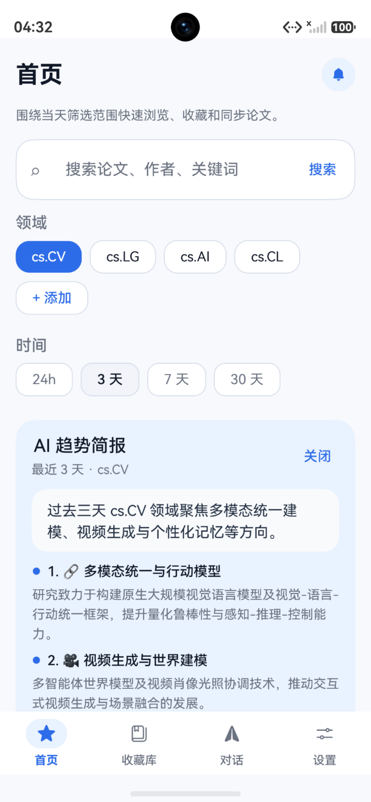
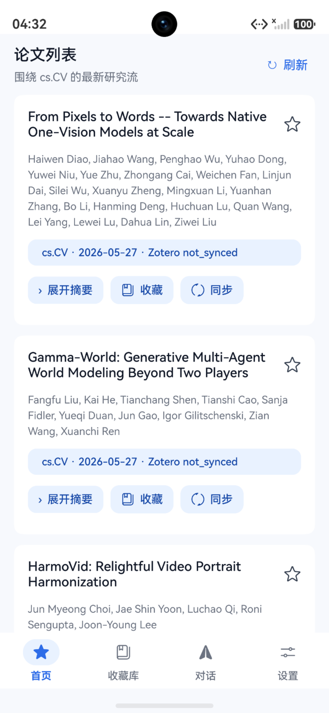
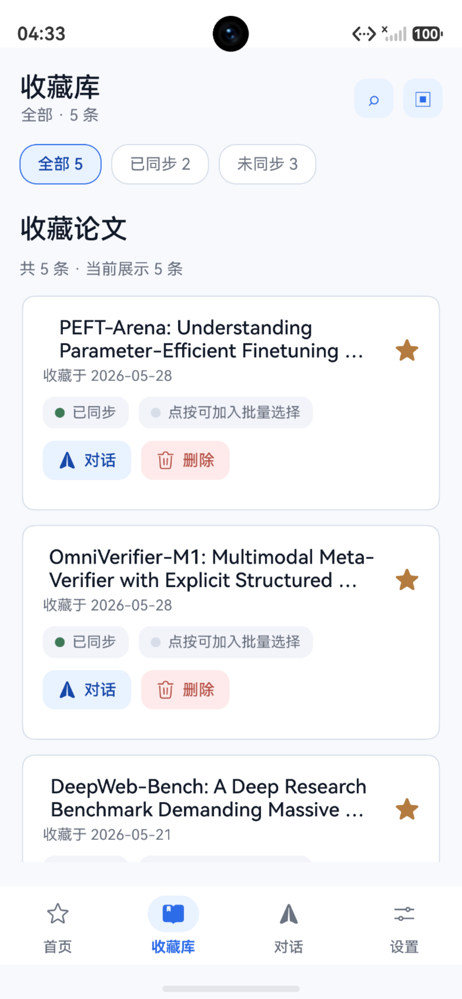
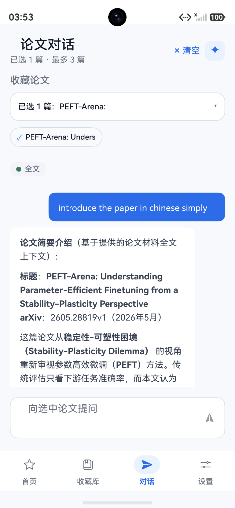
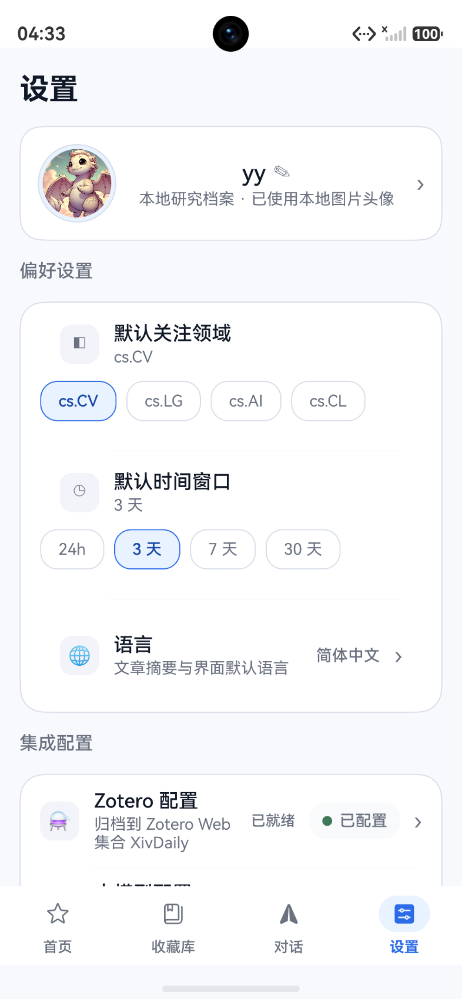
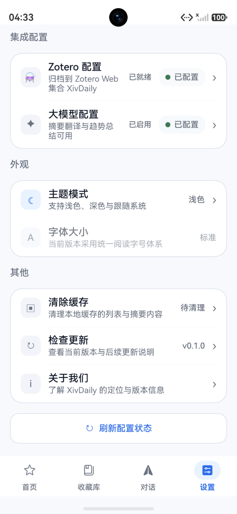

# 🌈 XivDaily HarmonyOS

<div align="center">
  <p>
    <strong>基于 ArkUI / ArkTS 的 HarmonyOS 科研阅读客户端</strong>
  </p>
</div>

## ✨ 模块概览

| 项目 | 说明 |
| --- | --- |
| Bundle Name | `com.xivdaily.harmony` |
| 工程模型 | Stage 模型 |
| UI 技术 | ArkUI |
| 语言 | ArkTS |
| 包管理 | ohpm |
| 构建工具 | Harmony 官方 `hvigor` 插件 |
| 模块 | `entry` 单模块应用 |
| 目标设备 | `phone` |
| 当前版本 | `0.1.0` |
| 权限 | 已声明 `ohos.permission.INTERNET` |

## 🧭 页面能力

| 页面 | 入口文件 | 主要能力 |
| --- | --- | --- |
| 🏠 首页 | `entry/src/main/ets/view/HomePage.ets` | 论文流、趋势摘要、摘要翻译、收藏和 Zotero 同步入口 |
| 📚 收藏库 | `entry/src/main/ets/view/LibraryPage.ets` | 本地收藏、同步状态筛选、批量删除、BibTeX 导出 |
| 💬 论文对话 | `entry/src/main/ets/view/ChatPage.ets` | 选择收藏论文发起对话，结合历史消息与论文上下文问答 |
| ⚙️ 设置页 | `entry/src/main/ets/view/SettingsPage.ets` | 管理偏好、清理缓存、保存 / 测试 Zotero 与 LLM 配置 |

## 🚀 当前实现重点

| 方向 | 位置 | 说明 |
| --- | --- | --- |
| 应用入口 | `entry/src/main/ets/pages/XivDailyPage.ets` | 使用四个标签页组织主界面 |
| 统一状态 | `entry/src/main/ets/viewmodel/AppViewModel.ets` | 汇总首页、收藏、聊天、设置状态和动作 |
| 网络请求 | `entry/src/main/ets/service/PaperService.ets` | 对接后端论文流、趋势、翻译、聊天、配置、Zotero 接口 |
| 收藏持久化 | `entry/src/main/ets/service/FavoriteStoreService.ets` | 本地保存收藏论文与同步状态 |
| 偏好管理 | `entry/src/main/ets/service/PreferenceService.ets` | 管理默认分类、窗口等用户偏好 |
| 主题体系 | `entry/src/main/ets/common/theme/XivTheme.ets` | 统一配色与组件风格 |

## 🖼️ 界面预览

<table>
  <tr>
    <td align="center">
      <br />
      <sub>首页 · 论文列表</sub>
    </td>
    <td align="center">
      <br />
      <sub>首页 · 趋势摘要与动作区</sub>
    </td>
    <td align="center">
      <br />
      <sub>收藏库 · 本地归档</sub>
    </td>
  </tr>
  <tr>
    <td align="center">
      <br />
      <sub>论文对话 · 收藏论文上下文</sub>
    </td>
    <td align="center">
      <br />
      <sub>设置 · 偏好与状态</sub>
    </td>
    <td align="center">
      <br />
      <sub>设置 · Zotero 与 LLM</sub>
    </td>
  </tr>
</table>

## 📁 目录速览

```text
harmony/
├── AppScope/
│   └── app.json5                    # bundleName、版本、图标
├── entry/
│   └── src/main/
│       ├── ets/
│       │   ├── common/              # 常量与主题
│       │   ├── entryability/        # EntryAbility
│       │   ├── model/               # 页面状态模型
│       │   ├── pages/               # 根页面与标签页容器
│       │   ├── service/             # 后端请求 / 本地存储 / 偏好
│       │   ├── view/                # Home / Library / Chat / Settings
│       │   └── viewmodel/           # AppViewModel
│       └── module.json5             # 模块声明、权限、页面入口
├── build-profile.json5
├── hvigorfile.ts
└── oh-package.json5
```

## ⚡ 运行方式

### 1. 安装依赖

```powershell
cd harmony
ohpm install
```

### 2. 使用 DevEco Studio 运行

1. 用 DevEco Studio 打开 `harmony/` 目录。
2. 等待 IDE 同步 `ohpm` 与 `hvigor` 依赖。
3. 选择 `entry` 模块，直接运行到 Harmony 模拟器或真机。

当前仓库没有额外封装 `hvigorw` 脚本，推荐直接使用 DevEco Studio 的默认构建 / 运行流程。

## 🌐 后端连接策略

`PaperService.ets` 当前内置以下候选后端地址，并在请求失败时按顺序重试：

```text
https://beginnerforever.eu.cc/
http://10.0.2.2:8000/
http://127.0.0.1:8000/
```

说明：

- `10.0.2.2` 适合模拟器联调本机后端。
- 公网地址适合直接连部署环境。
- `127.0.0.1` 仅在设备与服务位于同一网络上下文时有效。

## ⚙️ 设置与数据

| 方向 | 说明 |
| --- | --- |
| 收藏数据 | `FavoriteStoreService` 维护本地收藏及 Zotero 同步状态 |
| 用户偏好 | `PreferenceService` 维护分类、窗口等设置 |
| 集成配置 | 设置页会调用后端 `config/*` 与 `zotero/*` 接口保存 / 测试配置 |
| 聊天约束 | 当前一次最多选择 3 篇收藏论文进入对话 |

## 📝 开发说明

- `AppViewModel.ets` 已经接通首页刷新、趋势摘要、摘要翻译、收藏切换、Zotero 同步、BibTeX 导出、论文对话与设置页动作。
- `module.json5` 已声明 `INTERNET` 权限并固定竖屏入口能力。
- 若后续扩展多模块或桌面设备形态，优先在 `entry` 模块之外增量拆分，而不是直接把现有页面继续堆进单文件中。
